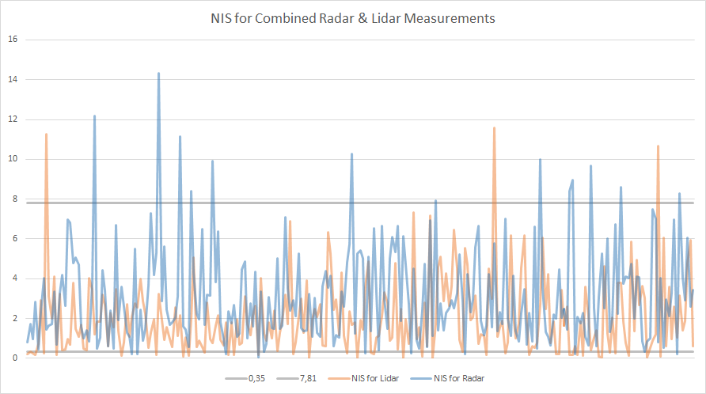

# Self Driving Car Engineer Project 7 - Unscented Kalman Filter
## Benjamin Söllner, 31 Aug 2017

---


---

In this project I am utilizing a unscented kalman filter to estimate the state of a moving object of interest with noisy lidar and radar measurements. Passing the project requires obtaining RMSE values lower than the threshold and Normalized-Innovation-Squared (NIS) values within the tolerances outlined by the project rubric.

This project involves the Term 2 Simulator which can be downloaded [here](https://github.com/udacity/self-driving-car-sim/releases).


The process model which describes the motion was tweaked to be comparable to the movement of cyclists (using approx. 0.8m/s² = 2.88km/h per second acceleration change and 22.5 degree/second² angular acceleration).

```c++
// Process noise standard deviation longitudinal acceleration in m/s^2
std_a_ = 0.8;
// Process noise standard deviation yaw acceleration in rad/s^2
std_yawdd_ = M_PI / 8.0;
```

As you can see in the charts below, >80% of the NIS values fall always nicely into the specified range between 0.35 and 7.81:



When using both lidar & radar data, 206 out of 249 measurements for lidar (83%) and 226 of 249 measurements for radar (91%) fall within the specified range.


When using only lidar data, 209 out of 249 measurements (84%) fall within the specified range.


When using only radar data, 225 out of 249 measurements (90%) fall within the specified range.

## Dependencies

* [uWebSocketIO](https://github.com/uWebSockets/uWebSockets) for either Linux or Mac systems.
* cmake >= 3.5
  * All OSes: [click here for installation instructions](https://cmake.org/install/)
* make >= 4.1
  * Linux: make is installed by default on most Linux distros
  * Mac: [install Xcode command line tools to get make](https://developer.apple.com/xcode/features/)
  * Windows: [Click here for installation instructions](http://gnuwin32.sourceforge.net/packages/make.htm)
* gcc/g++ >= 5.4
  * Linux: gcc / g++ is installed by default on most Linux distros
  * Mac: same deal as make - [install Xcode command line tools](https://developer.apple.com/xcode/features/)
  * Windows: recommend using [MinGW](http://www.mingw.org/)

## Making

Once the install for uWebSocketIO is complete, the main program can be built and run by doing the following from the project top directory.

1. mkdir build
2. cd build
3. cmake ..
4. make
5. ./UnscentedKF

The project can also be built with Microsoft Visual Studio [according to a useful article from Fahid Zubair](https://medium.com/@fzubair/udacity-carnd-term2-visual-studio-2015-17-setup-cca602e0b1cd).

## Submitted Files

* [``README.md``](README.md), [``readme.html``](readme.html): you are reading it! :)
* [``src/ukf.cpp``](src/ukf.cpp): Unscented Kalman filter usage for lidar and radar
* [``src/tools.cpp``](src/tools.cpp), [``src/tools.h``](src/tools.h): tools to compute RMSE values
